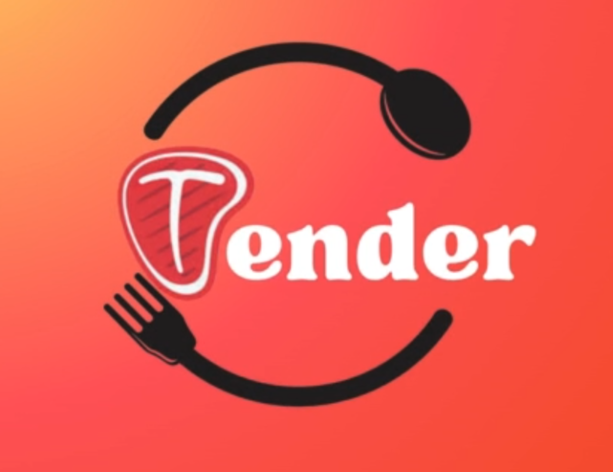
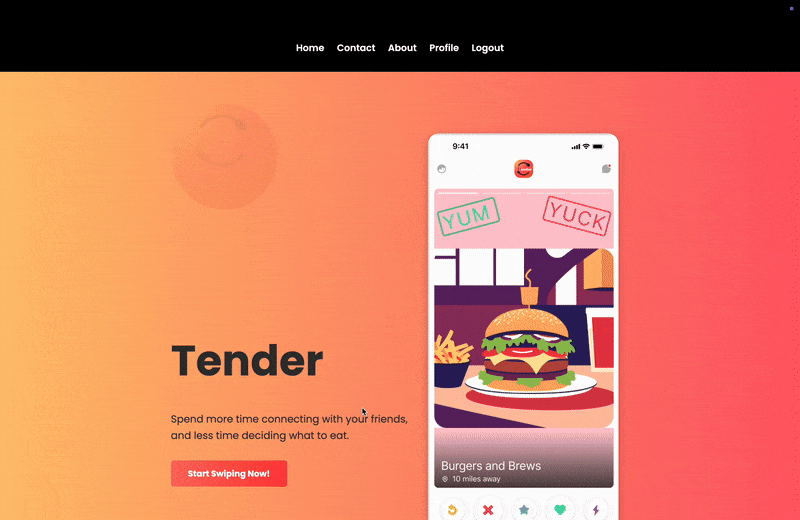

<p align="center">

</p>

# Tender

A playful nod to the dating app Tinder. Tender is lightweight, interactive voting-room app designed to help friends choose a restaurant together. Just like *Tinder* helps people match with potential dates by swiping, *Tender* helps groups of friends “match” with restaurants by swiping on local food spots. 

***Our goal is simple: Less time deciding, more time connecting.***

## Features

- **Real-Time Voting Rooms**: Instantly create a room and share an invite link with friends. 
- **Live UI Updates:** The voting room polls the server to show who has finished voting in real-time without needing a page refresh.
- **Dynamic "It’s a Match!" Screen:** Animated results reveal the winning restaurant after everyone has voted.
- **Google Places API Integration:** Pulls in live restaurant data based on the location of your choice.
- **Secure Authentication:** Registration, login, and session management with Flask-Security-Too.  
- **Testing Built-In:** Automated tests with Pytest ensure reliability.

## Tech Stack

- **Backend**: Python, Flask, Flask-Security-Too
- **Frontend**: HTML, JavaScript, CSS
- **Database**: SQLAlchemy, Alembic(Migrations), SQLite(Development)
- **API**: Google Places API
- **Testing**: Pytest, pytest-flask
- **Deployment**: Render, Gunicorn

## Getting started

To run this project on your local machine, follow these steps:

### 1. Clone the repository

```bash
git clone https://github.com/Saavesh/Tender.git
cd Tender
```

### 2. Create and activate a virtual environment

  ```bash
python3 -m venv venv
source venv/bin/activate
  ```

### 3. Install dependencies

  ```bash
  pip install -r requirements.txt
  ```

### 4. Set up environment variables

This step creates your private .env file and populates it with unique secret keys. Choose the command for your operating system. **Don't worry, .env is already included in .gitignore! So your secrets are safe *from* us.**
  
  <details>
  <summary>MacOS / Linux (Bash)</summary>
  
```bash
# This single command copies the template, generates two unique keys, and updates the file.
cp .env.example .env && \
KEY=$(python -c 'import secrets; print(secrets.token_hex(16))') && \
SALT=$(python -c 'import secrets; print(secrets.token_hex(16))') && \
sed -i '' -e "s/'a_strong_and_random_secret_key'/$KEY/" -e "s/'a_different_strong_and_random_salt'/$SALT/" .env
```

  </details>

  <details>
  <summary>Windows (PowerShell)</summary>

```bash
# This single command copies the template, generates two unique keys, and updates the file.
Copy-Item .env.example .env; (Get-Content .env) | ForEach-Object { $_ -replace "'a_strong_and_random_secret_key'", (python -c 'import secrets; print(secrets.token_hex(16))') -replace "'a_different_strong_and_random_salt'", (python -c 'import secrets; print(secrets.token_hex(16))') } | Set-Content .env
```

</details>

After running the command, you still need to manually add your Google Places API key. 

1. Get an **API key** by following the [Google Cloud Documentation](https://developers.google.com/maps/documentation/places/web-service/get-api-key). Make sure to enable the **Places API.**
2. Open your new .env file and paste the key in place of the `your_google_api_key_here` placeholder.

### 5. Initialize and upgrade the database

```bash
flask db upgrade
```

### 6. Run the application

```bash
flask run
```

## Live Demo

👉 [Tender on Render](https://tender-l253.onrender.com)

## Basic Usage

Here's a quick walkthrough of how Tender works as a guest user:

### 1. Create a room



### 2. Vote with friend(s)


### 3. See your match!


## Project structure

```bash
.
├── application/
│   ├── static/           # Front-end files -> CSS, JS, images, videos
│   ├── templates/        # HTML Page layouts shown to users
│   ├── __init__.py       # Starts the app & wires everything together
│   ├── extensions.py     # Sets up add-ons -> database, login, email, caching
│   ├── models.py         # The database shapes (what tables look like)
│   └── routes.py         # The app’s URLs and what each one does
├── instance/
│   └── .gitkeep          # Ensures instance folder is created
├── migrations/           # Instructions to create/update database
├── tests/                # Tests
├── run.py                # Run this to start the app for local development
├── requirements.txt      # Dependencies required for the local version
├── pytest.ini            # Settings for running the tests
└── .gitignore            # Git will not track files included in here
```

## Acknowledgments

This application began as a group project for a web development course at CU Boulder. While this version is a personal continuation and refactoring of the original concept, its foundation was built with a fantastic team.

A special thanks to my original teammates for their invaluable contributions and for making the project a genuinely fun experience. The original repository can be found **[HERE](https://github.com/tylerteichmann/CSPB_3308_T6_Project.git).**

## Future Improvements

Tender is a functional proof-of-concept with many exciting possibilities for future development. Some of these potential features include:

- **True Swipe Functionality:** Implement draggable, Tinder-style gestures for a more engaging experience.
- **Advanced Filtering:** Options for cuisine, price, and rating.
- **Customizable Search Radius:** Let the room creator set how far to search.
- **Expanded Results:** Include more restaurants per session.
- **Streamlined Invites:** Simplify the process of joining and sharing rooms.
  
## License

This project is licensed under the MIT License - see the [LICENSE](LICENSE) file for details.